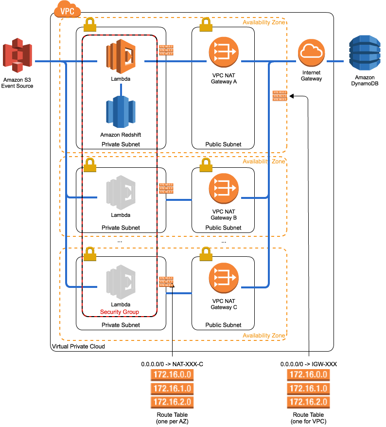
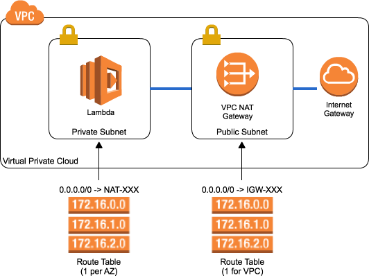

## Getting Started - Granting AWS Lambda rights to access your Redshift cluster

### Redshift running in VPC

In this model, your Redshift cluster is in a VPC Subnet, and we recommend using [AWS Lambda VPC Endpoints](http://docs.aws.amazon.com/lambda/latest/dg/vpc.html) to manage access to your cluster. The following diagram represents the configuration required to successfully run this solution in a VPC:

In this architecture, you expose your AWS Lambda function into a set of private VPC subnets, and then select a security group for your Lambda function. Ideally this would be the same security group as the Redshift cluster was using, but you can also use security group grants to enable access between two SG's. Your Lambda function must also have internet egress enabled so it can read its configuration from DynamoDB, and the easiest way to do this is to use [VPC NAT Gateway](http://docs.aws.amazon.com/AmazonVPC/latest/UserGuide/vpc-nat-gateway.html). The following steps should be undertaken:

_VPC_

To use Lambda in a VPC, we recommend having both a private and public subnet per AZ. Your Lambda function is enabled to run within the Private AZ, and a NAT Gateway is created in the Public AZ. Your Private Subnets will each have their own Route Table, with a route for 0.0.0.0/0 (public internet) routed to the NAT Gateway in the same AZ. Your Public Subnets will all share a Route Table which routes 0.0.0.0/0 to the Internet Gateway.

_AWS Lambda_

* Create a new VPC security group for your AWS Lambda function, which typically includes output access to anything (0.0.0.0/0 ALLOW)
* Go into your Lambda function configuration, and select 'Advanced settings'. Then select the VPC where your Redshift cluster resides. Then select the Subnets where you want your Lambda function to egress for VPC connectivity. In the diagram above we show it being able to egress into the same subnet as your Redshift Cluster, but this is not a hard requirement

_Redshift_

* Go into your Redshift Cluster, and select the VPC Security Groups entry that you want to use for enabling your function to connect
* Add a new Inbound Rule, Type = Redshift, Source = Custom IP, Port = the port for your cluster, and Destination set to the name of the Lambda Security Group created above.

At this point, your lambda function should be able to connect to your Redshift cluster, but would not be able to determine which clusters to connect to when it receives an S3 event. So we need to enable your Lambda function to connect to DynamoDB

### Redshift running in EC2 Classic/Not in VPC

To grant AWS Lambda access to our cluster, we must enable Cluster Security Groups to allow access from the public internet.

To configure a cluster security group for access:

1.	Log in to the Amazon Redshift console.
2.	Select Security in the navigation pane on the left.
3.	Choose the cluster security group in which your cluster is configured.
4.	Add a new Connection Type of CIDR/IP and enter the value 0.0.0.0/0.
5.	Select Authorize to save your changes.

We recommend granting Amazon Redshift users only INSERT rights on tables to be
loaded. Create a user with a complex password using the CREATE USER command
(http://docs.aws.amazon.com/redshift/latest/dg/r_CREATE_USER.html), and grant
INSERT using GRANT (http://docs.aws.amazon.com/redshift/latest/dg/r_GRANT.html).

### If you want to use http proxy instead of NAT gateway

To configure environment variable of your Lambda function:

1. Add a variable. Key is `https_proxy`.
2. Fill a variable. For example `http://proxy.example.org:3128`