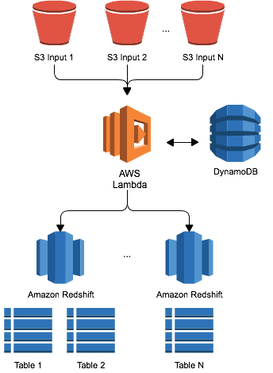

# A Zero Administration AWS Lambda Based Amazon Redshift Database Loader

With this AWS Lambda function, it's never been easier to get file data into Amazon
Redshift. You simply push files into a variety of locations on Amazon S3, and
have them automatically loaded into your Amazon Redshift clusters.

For automated delivery of streaming data to S3 and subsequently to Redshift, also consider using [Amazon Kinesis Firehose](https://aws.amazon.com/kinesis/firehose).

Table of Contents
=================

  * [A Zero Administration AWS Lambda Based Amazon Redshift Database Loader](#a-zero-administration-aws-lambda-based-amazon-redshift-database-loader)
    * [Using AWS Lambda with Amazon Redshift](#using-aws-lambda-with-amazon-redshift)
    * [Getting Started - Lambda Execution Role](#getting-started---lambda-execution-role)
    * [Getting Started - Deploying the AWS Lambda Function](#getting-started---deploying-the-aws-lambda-function)
      * [Lambda Function Versions](#lambda-function-versions)
    * [Getting Started - Granting AWS Lambda rights to access your Redshift cluster](#getting-started---granting-aws-lambda-rights-to-access-your-redshift-cluster)
      * [Redshift running in VPC](#redshift-running-in-vpc)
      * [Redshift running in EC2 Classic/Not in VPC](#redshift-running-in-ec2-classicnot-in-vpc)
      * [If you want to use http proxy instead of NAT gateway](#if-you-want-to-use-http-proxy-instead-of-nat-gateway)
    * [Getting Started - Support for Notifications &amp; Complex Workflows](#getting-started---support-for-notifications--complex-workflows)
    * [Getting Started - Entering the Configuration](#getting-started---entering-the-configuration)
    * [The Configuration S3 Prefix](#the-configuration-s3-prefix)
      * [Hive Partitioning Style Wildcards](#hive-partitioning-style-wildcards)
      * [S3 Prefix Matching](#s3-prefix-matching)
  * [Security](#security)
    * [Loading multiple Redshift Clusters concurrently](#loading-multiple-redshift-clusters-concurrently)
    * [Viewing Previous Batches &amp; Status](#viewing-previous-batches--status)
    * [Working With Processed Files](#working-with-processed-files)
    * [Reprocessing a Batch](#reprocessing-a-batch)
    * [Unlocking a Batch](#unlocking-a-batch)
    * [Changing your stored Database Password or S3 Secret Key Information](#changing-your-stored-database-password-or-s3-secret-key-information)
    * [Ensuring Loads happen every N minutes](#ensuring-loads-happen-every-n-minutes)
      * [Using Scheduled Lambda Functions](#using-scheduled-lambda-functions)
      * [Through a CRON Job](#through-a-cron-job)
    * [Reviewing Logs](#reviewing-logs)
    * [Extending and Building New Features](#extending-and-building-new-features)
  * [Configuration Reference](#configuration-reference)


## Using AWS Lambda with Amazon Redshift
Amazon Redshift is a fully managed petabyte scale data warehouse available for
less than $1000/TB/YR that provides AWS customers with an extremely powerful way to
analyse their applications and business as a whole. To load their Clusters, customers
ingest data from a large number of sources, whether they are FTP locations managed
by third parties, or internal applications generating load files. Best practice for
loading Amazon Redshift is to use the COPY command (http://docs.aws.amazon.com/redshift/latest/dg/r_COPY.html), which loads data in parallel from Amazon S3, Amazon DynamoDB or an HDFS file system on Amazon Elastic MapReduce (EMR).

Whatever the input, customers must run servers that look for new data on the file
system, and manage the workflow of loading new data and dealing with any issues
that might arise. That's why we created the AWS Lambda-based Amazon Redshift loader
(http://github.com/awslabs/aws-lambda-redshift-loader) - it offers you the ability
drop files into S3 and load them into any number of database tables in multiple
Amazon Redshift Clusters automatically - with no servers to maintain. This is possible
because AWS Lambda (http://aws.amazon.com/lambda) provides an event-driven, zero-administration
compute service. It allows developers to create applications that are automatically
hosted and scaled, while providing you with a fine-grained pricing structure.



The function maintains a list of all the files to be loaded from S3 into Amazon
Redshift using a DynamoDB table. This list allows us to confirm that a file is loaded
only one time, and allows you to determine when a file was loaded and into which table.
Input file locations are buffered up to a specified batch size that you control, or
you can specify a time-based threshold which triggers a load.

You can specify any of the many COPY options available, and we support loading
CSV files (of any delimiter), AVRO files, as well as JSON files (with or without JSON
paths specifications). All Passwords and Access Keys are encrypted for security.
With AWS Lambda you get automatic scaling, high availability, and built in Amazon
CloudWatch Logging.

Finally, we've provided tools to manage the status of your load processes, with
built in configuration management and the ability to monitor batch status and
troubleshoot issues. We also support sending notifications of load status through
Simple Notification Service - SNS (http://aws.amazon.com/sns), so you have visibility
into how your loads are progressing over time.

## Getting Started - Lambda Execution Role
You also need to add an IAM policy as shown below to the role that AWS Lambda
uses when it runs. Once your function is deployed, add the following policy to
the `LambdaExecRole` to enable AWS Lambda to call SNS, use DynamoDB, write Manifest
files to S3, perform encryption with the AWS Key Management Service, and pass STS temporary
credentials to Redshift for the COPY command:

```
{
    "Version": "2012-10-17",
    "Statement": [
        {
            "Sid": "Stmt1424787824000",
            "Effect": "Allow",
            "Action": [
                "dynamodb:DeleteItem",
                "dynamodb:DescribeTable",
                "dynamodb:GetItem",
                "dynamodb:ListTables",
                "dynamodb:PutItem",
                "dynamodb:Query",
                "dynamodb:Scan",
                "dynamodb:UpdateItem",
                "sns:GetEndpointAttributes",
                "sns:GetSubscriptionAttributes",
                "sns:GetTopicAttributes",
                "sns:ListTopics",
                "sns:Publish",
                "sns:Subscribe",
                "sns:Unsubscribe",
                "s3:Get*",
                "s3:Put*",
                "s3:List*",
                "kms:Decrypt",
                "kms:DescribeKey",
                "kms:GetKeyPolicy"
            ],
            "Resource": [
                "*"
            ]
        }
    ]
}
```


## Getting Started - Deploying the AWS Lambda Function
To deploy the function:

1.	Go to the AWS Lambda Console in the same region as your S3 bucket and Amazon Redshift cluster.
2.	Select Create a Lambda function and select the 'Author from Scratch' option
3. Enter the function name `LambdaRedshiftLoader`, and the Runtime value as 'Node.js 6.10'. The function name must be `LambdaRedshiftLoader` in order to use automated event source routing.
4. Choose the IAM role that you would like to run the Lambda function under, as configured above
5. Choose 'Create Function'
6. Under the 'Function code' section, choose 'Upload a file from Amazon S3', and use the table below to find the correct s3 location for your region.
7. Configure the default values of index.js for the filename and handler for the handler.  We also recommend using the max timeout for the function to accomodate longer COPY times.

| Region | Function Code S3 Location |
| ------ | ---- |
| ap-south-1 | [s3://awslabs-code-ap-south-1/LambdaRedshiftLoader/AWSLambdaRedshiftLoader-2.6.6.zip](https://s3.ap-south-1.amazonaws.com/awslabs-code-ap-south-1/LambdaRedshiftLoader/AWSLambdaRedshiftLoader-2.6.6.zip)
| eu-west-3 | [s3://awslabs-code-eu-west-3/LambdaRedshiftLoader/AWSLambdaRedshiftLoader-2.6.6.zip](https://s3.eu-west-3.amazonaws.com/awslabs-code-eu-west-3/LambdaRedshiftLoader/AWSLambdaRedshiftLoader-2.6.6.zip)
| eu-west-2 | [s3://awslabs-code-eu-west-2/LambdaRedshiftLoader/AWSLambdaRedshiftLoader-2.6.6.zip](https://s3.eu-west-2.amazonaws.com/awslabs-code-eu-west-2/LambdaRedshiftLoader/AWSLambdaRedshiftLoader-2.6.6.zip)
| eu-west-1 | [s3://awslabs-code-eu-west-1/LambdaRedshiftLoader/AWSLambdaRedshiftLoader-2.6.6.zip](https://s3.eu-west-1.amazonaws.com/awslabs-code-eu-west-1/LambdaRedshiftLoader/AWSLambdaRedshiftLoader-2.6.6.zip)
| ap-northeast-3 | [s3://awslabs-code-ap-northeast-3/LambdaRedshiftLoader/AWSLambdaRedshiftLoader-2.6.6.zip](https://s3.ap-northeast-3.amazonaws.com/awslabs-code-ap-northeast-3/LambdaRedshiftLoader/AWSLambdaRedshiftLoader-2.6.6.zip)
| ap-northeast-2 | [s3://awslabs-code-ap-northeast-2/LambdaRedshiftLoader/AWSLambdaRedshiftLoader-2.6.6.zip](https://s3.ap-northeast-2.amazonaws.com/awslabs-code-ap-northeast-2/LambdaRedshiftLoader/AWSLambdaRedshiftLoader-2.6.6.zip)
| ap-northeast-1 | [s3://awslabs-code-ap-northeast-1/LambdaRedshiftLoader/AWSLambdaRedshiftLoader-2.6.6.zip](https://s3.ap-northeast-1.amazonaws.com/awslabs-code-ap-northeast-1/LambdaRedshiftLoader/AWSLambdaRedshiftLoader-2.6.6.zip)
| sa-east-1 | [s3://awslabs-code-sa-east-1/LambdaRedshiftLoader/AWSLambdaRedshiftLoader-2.6.6.zip](https://s3.sa-east-1.amazonaws.com/awslabs-code-sa-east-1/LambdaRedshiftLoader/AWSLambdaRedshiftLoader-2.6.6.zip)
| ca-central-1 | [s3://awslabs-code-ca-central-1/LambdaRedshiftLoader/AWSLambdaRedshiftLoader-2.6.6.zip](https://s3.ca-central-1.amazonaws.com/awslabs-code-ca-central-1/LambdaRedshiftLoader/AWSLambdaRedshiftLoader-2.6.6.zip)
| ap-southeast-1 | [s3://awslabs-code-ap-southeast-1/LambdaRedshiftLoader/AWSLambdaRedshiftLoader-2.6.6.zip](https://s3.ap-southeast-1.amazonaws.com/awslabs-code-ap-southeast-1/LambdaRedshiftLoader/AWSLambdaRedshiftLoader-2.6.6.zip)
| ap-southeast-2 | [s3://awslabs-code-ap-southeast-2/LambdaRedshiftLoader/AWSLambdaRedshiftLoader-2.6.6.zip](https://s3.ap-southeast-2.amazonaws.com/awslabs-code-ap-southeast-2/LambdaRedshiftLoader/AWSLambdaRedshiftLoader-2.6.6.zip)
| eu-central-1 | [s3://awslabs-code-eu-central-1/LambdaRedshiftLoader/AWSLambdaRedshiftLoader-2.6.6.zip](https://s3.eu-central-1.amazonaws.com/awslabs-code-eu-central-1/LambdaRedshiftLoader/AWSLambdaRedshiftLoader-2.6.6.zip)
| us-east-1 | [s3://awslabs-code-us-east-1/LambdaRedshiftLoader/AWSLambdaRedshiftLoader-2.6.6.zip](https://s3.amazonaws.com/awslabs-code-us-east-1/LambdaRedshiftLoader/AWSLambdaRedshiftLoader-2.6.6.zip)
| us-east-2 | [s3://awslabs-code-us-east-2/LambdaRedshiftLoader/AWSLambdaRedshiftLoader-2.6.6.zip](https://s3.us-east-2.amazonaws.com/awslabs-code-us-east-2/LambdaRedshiftLoader/AWSLambdaRedshiftLoader-2.6.6.zip)
| us-west-1 | [s3://awslabs-code-us-west-1/LambdaRedshiftLoader/AWSLambdaRedshiftLoader-2.6.6.zip](https://s3.us-west-1.amazonaws.com/awslabs-code-us-west-1/LambdaRedshiftLoader/AWSLambdaRedshiftLoader-2.6.6.zip)
| us-west-2 | [s3://awslabs-code-us-west-2/LambdaRedshiftLoader/AWSLambdaRedshiftLoader-2.6.6.zip](https://s3.us-west-2.amazonaws.com/awslabs-code-us-west-2/LambdaRedshiftLoader/AWSLambdaRedshiftLoader-2.6.6.zip)


When you're done, you'll see that the AWS Lambda function is deployed and you
can submit test events and view the CloudWatch Logging log streams.

### Lambda Function Versions
We previously released version 1.0 in distribution AWSLambdaRedshiftLoader.zip,
which didn't use the Amazon Key Management Service for encryption. If you've
previously deployed and used version 1.0 and want to upgrade to version 1.1,
then you'll need to recreate your configuration by running `node setup.js` and
reentering the previous values including connection password, symmetric encryption key, and optionally an S3 Secret Key.
You'll also need to upgrade the IAM policy for the Lambda Execution Role as listed
below, as it now requires permissions to talk to the Key Management Service.

Furthermore, version 2.0.0 adds support for loading multiple Redshift clusters in
parallel. You can deploy the 2.x versions with a 1.1x configuration, and the
Lambda function will transparently upgrade your configuration to a 2.x compatible
format. This uses a loadClusters List type in DynamoDB to track all clusters to
be loaded.

## Getting Started - Lambda, Redshift, and VPC networking

Please click [here](Networking.md) for a full guide on how to configure AWS Lambda to connect to Redshift in VPC and non-VPC networking environments.

## Getting Started - Entering the Configuration
Now that your function is deployed, we need to create a configuration which tells
it how and if files should be loaded from S3. Simply install AWS SDK for Javascript
and configure it with credentials as outlined at http://docs.aws.amazon.com/AWSJavaScriptSDK/guide/node-intro.html and http://docs.aws.amazon.com/AWSJavaScriptSDK/guide/node-configuring.html. You'll also need a local instance of Node.js - today the included Client Tools such as `setup.js` only run under pre-ES6 versions of Node (0.10 and 0.12 have been tested). NVM (https://github.com/creationix/nvm/blob/master/README.markdown) is a simple way to install and switch between node versions. Then install dependencies using the following command:

`cd aws-lambda-redshift-loader && npm install`

In order to ensure communication with the correct AWS Region, you'll need to set
an environment variable `AWS_REGION` to the desired location. For example,
for US East use `us-east-1`, and for Dublin use `eu-west-1`.

```export AWS_REGION=eu-central-1```

Next, run the setup.js script by entering `node setup.js`. The script asks questions
about how the load should be done, including those outlined in the setup appendix
as the end of this document. If you are the sort of person who would rather automate this, then you can call the setup module directly by including `common.js` and calling `function setup(useConfig, dynamoDB, s3, lambda, callback)` where `useConfig` is a valid configuration in the form of a DynamoDB Item, and `dynamoDB`, `S3` and `lambda` are all client connections to the respective services.

Alternatively, you can populate config.json with your configuration values and run
`node setup-file.js` to run a setup script that uses a JSON configuration file
instead of reading the values from the command line.

All data used to manage the lifecycle of data loads is stored in DynamoDB, and
the setup script automatically provisions the following tables:

* LambdaRedshiftBatchLoadConfig - Stores the configuration of how files in an S3 input prefix should be loaded into Amazon Redshift.
* LambdaRedshiftBatches - Stores the list of all historical and open batches that have been created. There will always be one open batch, and may be multiple closed batches per S3 input prefix from LambdaRedshiftBatchLoadConfig.
* LambdaRedshiftProcessedFiles - Stores the list of all files entered into a batch, which is also used for deduplication of input files.

Once the tables are configured, the setup script will automatically create an event source for the prefix you specified in S3, and start pushing `ObjectCreated:*` events to the database loader.

*** IMPORTANT ***
The tables used by this function are created with a max read & write per-second rate
of 5. This means that you will be able to accommodate 5 concurrent file uploads
per second being managed by ALL input locations which are event sources to this
Lambda function. If you require more than 5 concurrent invocations/second, then
you MUST increase the Read IOPS on the LambdaRedshiftBatchLoadConfig table, and
the Write IOPS on LambdaRedshiftBatches and LambdaRedshiftProcessedFiles to the
maximum number of files to be concurrently processed by all Configurations.

## The Configuration S3 Prefix

When you enter the configuration, you must provide an S3 Prefix. This is used by the function to resolve which configuration to use for an incoming event. There are two dimensions of dynamic resolution provided which will help you respond to events where the path is variable over time or from provider:

### Hive Partitioning Style Wildcards

You may have implemented a great practice of segregating S3 objects using time oriented buckets. Data for January 2016 sits in a prefix ```mybucket/data/<type>/2016/01``` while data for Feburary is in ```mybucket/data/<type>/2016/02```. Rather than having to create one configuration per year and month, you can instead use Hive Partitioning style prefixes. If you place S3 objects into a prefix ```mybucket/data/<type>/yyyy=2016/dd=01```, you can then create a configuration with an S3 prefix ```mybucket/data/<type>/yyyy=*/dd=*```. The incoming event will be pre-processed and files which use this convention will always match the wildcard configuration.

### S3 Prefix Matching

In some cases, you may want to have a configuration for most parts of a prefix, but a special configuration for just a subset of the data within a Prefix. In addition to Hive partitioning style wildcards, you can also create configuration hierarchies. In the above example, if I wanted to process data from 2016 with a single configuration, but had special rules for February only, then you can create 2 configurations:

* ```mybucket/data/<type>/2016``` This will match anything that is submitted for 2016, regardless of other information provided.
* ```mybucket/data/<type>/2016/02``` This will only match input events that were submitted for February 2016, and give you the ability to provide a new configuration item. Some examples of matching are included below:

| Input Prefix   | Matched Configuration    |
| :-----------   | :----------------------- |
| ```mybucket/data/uploads/2016/02/ELB``` | ```mybucket/data/uploads/2016/02``` |
| ```mybucket/data/uploads/2016/01/ELB``` ```mybucket/data/uploads/2016/03/ELB``` ```mybucket/data/uploads/2016/04/ELB``` ```mybucket/data/uploads/2016/.../ELB``` ```mybucket/data/uploads/2016/12/ELB``` | ```mybucket/data/uploads/2016``` |
| ```vendor-uploads/inbound/unregistered-new-data-feed/csv/upload.zip``` | ```vendor-uploads/inbound/``` |
| ```vendor-uploads/inbound/vendor1/csv/upload.zip``` | ```vendor-uploads/inbound/vendor1``` |
| ```vendor-uploads/inbound/vendor2/csv/upload.zip``` | ```vendor-uploads/inbound/vendor2``` |

# Security

The database password, as well as the a master symmetric key used for encryption
will be encrypted by the [Amazon Key Management Service](https://aws.amazon.com/kms). This encryption is done with a KMS
Customer Master Key with an alias named `alias/LambaRedshiftLoaderKey`.

When the Redshift COPY command is created, by default the Lambda function will use a
temporary STS token as credentials for Redshift to use when accessing S3. You can also optionally configure
an Access Key and Secret Key which will be used instead, and
the setup utility will encrypt the secret key.

## Loading multiple Redshift Clusters concurrently

Version 2.0.0 and higher adds the ability to load multiple clusters at the same time. To
configure an additional cluster, you must first have deployed version
```AWSLambdaRedshiftLoader-2.1.0.zip``` or higher and had your configuration upgraded to 2.x
format (you will see a new loadClusters List type in your configuration). You
can then use the ```addAdditionalClusterEndpoint.js``` to add new clusters into
a single configuration. This will require you enter the vital details for the
cluster including endpoint address and port, DB name and password.

You are now ready to go. Simply place files that meet the configured format into
S3 at the location that you configured as the input location, and watch as AWS
Lambda loads them into your Amazon Redshift Cluster. You are charged by the number
of input files that are processed, plus a small charge for DynamoDB. You now have
a highly available load framework which doesn't require you manage servers!

## Support for Notifications & Complex Workflows

There are two options for creating complex ELT type data flows with the Lambda Loader. The first is to use pre and post-sql commands to prepare, load, and then react to new data being loaded into a table. This allows you to set the `presql` and `postsql` portions of the configuration to add SQL statements to manipulate the database as needed, and these statements are run transactionally with the `COPY` command.

In addition to pre/post-sql, this function can send notifications on completion of batch processing. Using SNS,
you can then receive notifications through email and HTTP Push to an application,
or put them into a queue for later processing. You can even invoke additional Lambda
functions to complete your data load workflow using an [SNS Event Sources](http://docs.aws.amazon.com/sns/latest/dg/sns-lambda.html) for another AWS Lambda function. If you would like to receive SNS notifications for succeeded loads, failed loads, or both, create SNS Topics and take note of their ID's in the
form of Amazon Resource Notations (ARN) for later use in the configuration setup. An example failure notification message:

```
{
  "batchId": "2790a034-4954-47a9-8c53-624575afd83d",
  "error": "{\"localhost\":{\"status\":-1,\"error\":{\"code\":\"ECONNREFUSED\",\"errno\":\"ECONNREFUSED\",\"syscall\":\"connect\",\"address\":\"127.0.0.1\",\"port\":5439}}}",
  "failedManifest": "meyersi-ire/redshift/manifest/failed/manifest-2018-04-26 10:34:02-5230",
  "key": "input/redshift-input-0.csv",
  "originalManifest": "meyersi-ire/redshift/manifest/manifest-2018-04-26 10:34:02-5230",
  "s3Prefix": "lambda-redshift-loader/input",
  "status": "error"
}
```

The loader supports the ability to suppress a failure status of the Lambda function if you have configured a failure notification SNS topic, which should only be used if you know that you've created a downstream workflow to deal with these notifications completely, and you do not want Lambda level failures to be exposed. Please note that this error suppression is only available for batch level load failures, and not for other types of failures of the function (for example if it's unable to complete a status update or send notifications at all). This suppression is only available if you've configured a `failureTopicARN` in your S3 prefix configuration.

To suppress Lambda level failures, set environment variable `SuppressFailureStatusOnSuccessfulNotification = 'true'` in your Lambda configuration.

## Viewing Previous Batches & Status

If you ever need to see what happened to batch loads into your Cluster, you can
use the 'queryBatches.js' script to look into the LambdaRedshiftBatches DynamoDB
table. It can be called by:

```
node queryBatches.js --region <region> --batchStatus <batchStatus> --startDate <beginning of date range> --endDate <end of date range>
```

* region - the region in which the AWS Lambda function is deployed
* batchStatus - the batch status you are querying for, including 'error', 'complete', 'pending', or 'locked'
* startDate - optional date argument to use as a start date for querying batches
* endDate - optional date argument to use as an end date for the query window

Running `node queryBatches.js --region eu-west-1 --batchStatus error` might return a list of all batches with a status of 'error' in the EU (Ireland) region, such as:

```
[
    {
        "s3Prefix": "lambda-redshift-loader-test/input",
        "batchId": "2588cc35-b52f-4408-af89-19e53f4acc11",
        "lastUpdateDate": "2015-02-26-16:50:18"
    },
    {
        "s3Prefix": "lambda-redshift-loader-test/input",
        "batchId": "2940888d-146c-47ff-809c-f5fa5d093814",
        "lastUpdateDate": "2015-02-26-16:50:18"
    }
]
```

If you require more detail on a specific batch, you can use describeBatch.js to
show all detail for a batch. It takes 3 arguments as well:

* region - the region in which the AWS Lambda function is deployed
* batchId - the batch you would like to see the detail for
* s3Prefix - the S3 Prefix the batch was created for

Which would return the batch information as it is stored in Dynamo DB:

```
{
    "batchId": {
        "S": "7325a064-f67e-416a-acca-17965bea9807"
    },
    "manifestFile": {
        "S": "my-bucket/manifest/manifest-2015-02-06-16:20:20-2081"
    },
    "s3Prefix": {
        "S": "input"
    },
    "entries": {
        "SS": [
            "input/sample-redshift-file-for-lambda-loader.csv",
            "input/sample-redshift-file-for-lambda-loader1.csv",
            "input/sample-redshift-file-for-lambda-loader2.csv",
            "input/sample-redshift-file-for-lambda-loader3.csv",
            "input/sample-redshift-file-for-lambda-loader4.csv",
            "input/sample-redshift-file-for-lambda-loader5.csv"
        ]
    },
    "lastUpdate": {
        "N": "1423239626.707"
    },
    "status": {
        "S": "complete"
    }
}
```

## Working with Processed Files
We'll only load a file once by default, but in certain rare cases you might
want to re-process a file, such as if a batch goes into error state for some reason.
If so, use the `processedFiles.js` script to query or delete processed files entries.
The script takes an `operation type` and `filename` as arguments:

* Use `--query` to query if a file has been processed at all, and if so by which batch.
* Use `--delete` to delete a given file entry.
* Use `--reprocess` for files that couldn't be added to a batch for some reason, which might include DynamoDB throttling. This will perform an in-place file copy on S3, which will then be received by the Lambda loader and it will attempt to reprocess the file. If it's already part of a batch, then it will be ignored. Please note this option is only supported by version 2.5.5 and higher.

An example of the processed files store can be seen below:


## Reprocessing a Batch
If you ever need to reprocess a batch - for example if it failed to load the required
files for some reason - then you can use the `reprocessBatch.js` script. This takes
the same arguments as `describeBatch.js` (region, batch ID & input location). The
original input batch is not affected; instead, each of the input files that were
part of the batch are removed from the `LambdaRedshiftProcessedFiles` table, and
then the script forces an S3 event to be generated for the file. This will be
captured and reprocessed by the function as it was originally. Please note you
can only reprocess batches that are not in 'open' status. Please also note that because this function reads and then re-writes object metadata, it is potentially liable to overwriting metadata added by a different process. If you have frequent S3 metadata re-write as part of your application, use with extreme caution.

## Unlocking a Batch
It is possible, but rare, that a batch would become locked but not be being processed
by AWS Lambda. If this were to happen, please use ```unlockBatch.js``` including
the region and Batch ID to set the batch to 'open' state again.

## Deleting Old Batches

As the system runs for some time, you may find that your `LambdaRedshiftBatches` table grows to be very large. In this case, you may want to archive old Completed batches that you no longer require.

__USE THIS FEATURE WITH CAUTION!!! IT WILL DELETE DATA!!!__

If you would like to clear out old delete batch entries, then you can use the `deleteBatches.js` script. It will allow you to query for batches that are 'complete' and then clear them out of the system. It does not currently support deleting other types of batches (`error, locked, pending`), as these *should* be reprocessed or would make no sense to delete. To run the script, execute:

```
deleteBatches.js --region <region> --batchStatus <batchStatus> --startDate <beginning of date range> --endDate <end of date range>
```

This function will return console output (and can also be used programmatically) and for example, when specified as above will show:

```
node deleteBatches.js --region eu-west-1 --batchStatus error
Dry run only - no batches will be modified
Resolved 1 Batches for Deletion
OK: Deletion of 0 Batches
Deleted Batch Information:
{ s3Prefix: 'lambda-redshift-loader-test/input',
  batchId: '43643fda-f829-4f60-820a-2ce331e62b18',
  status: 'complete',
  lastUpdateDate: '2016-03-10-10:33:12',
  lastUpdate: '1457605992.447' }

```

This will allow you test your batch deletion and understand the impact of performing such a change. When you are completely happy to delete batches as outlined in the dry run, then add `--dryRun` to the command line, or supply `false` for the dryRun parameter. This will __ACTUALLY REALLY DELETE BATCH INFORMATION__. To mitigate risk of data loss in error, the return of this function is an array of all the batch information that was deleted, so that you can save logfiles for future recovery if needed. For example:

```
node deleteBatches.js --region eu-west-1 --batchStatus error --endDate 1457434179 --dryRun false
Deleting 1 Batches in status error
OK: Deletion of 1 Batches
Deleted Batch Information:
{
  "batchId": {
    "S": "fe5876bc-9eeb-494c-a66d-ada4698f4405"
  },
  "clusterLoadStatus": {
    "S": {
      "db1.cluster.eu-west-1.redshift.amazonaws.com": {
        "error": {
          "code": "ETIMEDOUT",
          "errno": "ETIMEDOUT",
          "syscall": "connect"
        },
        "status": -1
      },
      "db2.cluster.amazonaws.com": {
        "error": {
          "code": "ENOTFOUND",
          "errno": "ENOTFOUND",
          "syscall": "getaddrinfo"
        },
        "status": -1
      }
    }
  },
  "entries": {
    "SS": [
      "lambda-redshift-loader-test/input/redshift-input-0.csv",
      "lambda-redshift-loader-test/input/redshift-input-2.csv"
    ]
  },
  "errorMessage": {
    "S": {
      "db1.cluster.eu-west-1.redshift.amazonaws.com": {
        "error": {
          "code": "ETIMEDOUT",
          "errno": "ETIMEDOUT",
          "syscall": "connect"
        },
        "status": -1
      },
      "db2.cluster.eu-west-1.redshift.amazonaws.com": {
        "error": {
          "code": "ENOTFOUND",
          "errno": "ENOTFOUND",
          "syscall": "getaddrinfo"
        },
        "status": -1
      }
    }
  },
  "lastUpdate": {
    "N": "1457434178.86"
  },
  "lastUpdateDate": "2016-03-08-10:49:38",
  "manifestFile": {
    "S": "my-bucket/lambda/redshift/failed/manifest-2016-03-08-10:47:30-1368"
  },
  "s3Prefix": {
    "S": "lambda-redshift-loader-test/input"
  },
  "status": {
    "S": "error"
  },
  "writeDates": {
    "NS": [
      "1457434049.802",
      "1457433786.56"
    ]
  }
}
```

As you can see the entire contents of the batch are returned to you, so that you can ensure no possiblity of data loss. The most important features of this returned data structure are likely `$entries.SS, $manifestFile.S`, which would allow you to re-inject files into the loader if needed.

## Changing your stored Database Password or S3 Secret Key Information
Currently you must edit the configuration manually in Dynamo DB to make changes.
If you need to update your Redshift DB Password, or your Secret Key for allowing
Redshift to access S3, then you can use the ```encryptValue.js``` script to encrypt
a value using the Lambda Redshift Loader master key and encryption context.

To run:
```
node encryptValue.js --region <region> --input <Value to Encrypt>
```

This script encrypts the value with Amazon KMS, and then verifies the encryption is
correct before returning a JSON object which includes the input value and the
encrypted Ciphertext. You can use the 'encryptedCiphertext' attribute of this object
to update the Dynamo DB Configuration.

## Ensuring Loads happen every N minutes
If you have a prefix that doesn't receive files very often, and want to ensure
that files are loaded every N seconds, use the following process to force periodic loads.

When you create the configuration, specify a `batchTimeoutSecs` and add a filenameFilterRegex such as '.*\.csv' (which
only loads CSV files that are put into the specified S3 prefix). Then every N seconds,
schedule one of the included trigger file generators to run:

### Using Scheduled Lambda Functions

You can use an included Lambda function to generate trigger files into all configured prefixes that have a regular expression filter, by completing the following:

* Create a new AWS Lambda Function, and deploy the same zip file from the `dist` folder as you did for the AWS Lambda Redshift Loader. However, when you configure the Handler name, use `createS3TriggerFile.handler`, and configure it with the timeout and RAM required.
* In the AWS Web Console, select Services/CloudWatch, and in the left hand navigation select 'Events/Rules'
* Choose Event Source = 'Schedule' and specify the interval for your trigger files to be gnerated
* Add Target to be the Lambda function you previously configured

Once done, you will see CloudWatch Logs being created on the configured schedule, and trigger files arriving in the specified prefixes

### Through a CRON Job

You can use a Python based script to generate trigger files to specific input buckets and prefixes, using the following utility:

```./path/to/function/dir/generate-trigger-file.py <region> <input bucket> <input prefix> <local working directory>```

* region - the region in which the input bucket for loads resides
* input bucket - the bucket which is configured as an input location
* input prefix - the prefix which is configured as an input location
* local working directory - the location where the stub dummy file will be kept prior to upload into S3

These methods write a file called 'lambda-redshift-trigger-file.dummy' to the configured
input prefix, which causes your deployed function to scan the open pending batch
and load the contents if the timeout seconds limit has been reached. The batch timeout is calculated on the basis of when the first file was added to the batch.

## Reviewing Logs
For normal operation, you won't have to do anything from an administration perspective.
Files placed into the configured S3 locations will be loaded when the number of
new files equals the configured batch size. You may want to create an operational
process to deal with failure notifications, but you can also just view the performance
of your loader by looking at Amazon CloudWatch. Open the CloudWatch console, and
then click 'Logs' in the lefthand navigation pane. You can then select the log
group for your function, with a name such as `/aws/lambda/<My Function>`.

Each of the above Log Streams were created by an AWS Lambda function invocation,
and will be rotated periodically. You can see the last ingestion time, which is
when AWS Lambda last pushed events into CloudWatch Logging.

You can then review each log stream, and see events where your function simply
buffered a file, or where it performed a load.

## Extending and Building New Features
We're excited to offer this AWS Lambda function under the Amazon Software License.
The GitHub repository does not include all the dependencies for Node.js, so in
order to build and run locally please install the following modules with npm install:

* Node Postgres - Native Postgres Driver for Javascript (https://github.com/brianc/node-postgres & `npm install pg`)
* Async - Higher-order functions and common patterns for asynchronous code (https://www.npmjs.com/package/async & `npm install async`)
* Node UUID - Rigorous implementation of RFC4122 (v1 and v4) UUIDs (https://www.npmjs.com/package/node-uuid & `npm install node-uuid`)

# Configuration Reference

The following section provides guidance on the configuration options supported.
For items such as the batch size, please keep in mind that in Preview the Lambda
function timeout is 60 seconds. This means that your COPY command must complete
in less than ~ 50 seconds so that the Lambda function has time to complete writing
batch metadata. The COPY time will be a function of file size, the number of files
to be loaded, the size of the cluster, and how many other processes might be consuming
WorkLoadManagement queue slots.

Item | Required | Notes
:---- | :--------: | :-----
Enter the Region for the Redshift Load Configuration| Y | Any AWS Region from http://docs.aws.amazon.com/general/latest/gr/rande.html, using the short name (for example us-east-1 for US East 1)
Enter the S3 Bucket & Prefix to watch for files | Y | An S3 Path in format `<bucket name>/<prefix>`. Prefix is optional
Enter a Filename Filter Regex | N | A Regular Expression used to filter files which appeared in the input prefix before they are processed.
Enter the Cluster Endpoint | Y | The Amazon Redshift Endpoint Address for the Cluster to be loaded.
Enter the Cluster Port | Y | The port on which you have configured your Amazon Redshift Cluster to run.
Enter the Database Name | Y | The database name in which the target table resides.
Enter the Database Username | Y | The username which should be used to connect to perform the COPY. Please note that only table owners can perform COPY, so this should be the schema in which the target table resides.
Enter the Database Password | Y | The password for the database user. Will be encrypted before storage in Dynamo DB.
Enter the Table to be Loaded | Y | The Table Name to be loaded with the input data.
Enter the comma-delimited column list | N | If you want to control the order of columns that are found in a CSV file, then list the columns here. Please see [Column List Syntax](http://docs.aws.amazon.com/redshift/latest/dg/copy-parameters-column-mapping.html#copy-column-list) for more information
Should the Table be Truncated before Load? (Y/N) | N | Option to truncate the table prior to loading. Use this option if you will subsequently process the input patch and only want to see 'new' data with this ELT process.
Ignore Header (first line) of the CSV file? (Y/N) | N | Option to ignore the first line of the CSV (Header)
Enter the Data Format (CSV, JSON or AVRO) | Y | Whether the data format is Character Separated Values, AVRO or JSON data (http://docs.aws.amazon.com/redshift/latest/dg/copy-usage_notes-copy-from-json.html).
If CSV, Enter the CSV Delimiter | Yes if Data Format = CSV | Single character delimiter value, such as ',' (comma) or '|' (pipe).
If JSON, Enter the JSON Paths File Location on S3 (or NULL for Auto) | Yes if Data Format = JSON | Location of the JSON paths file to use to map the file attributes to the database table. If not filled, the COPY command uses option 'json = auto' and the file attributes must have the same name as the column names in the target table.
Enter the S3 Bucket for Redshift COPY Manifests | Y | The S3 Bucket in which to store the manifest files used to perform the COPY. Should not be the input location for the load.
Enter the Prefix for Redshift COPY Manifests| Y | The prefix for COPY manifests.
Enter the Prefix to use for Failed Load Manifest Storage | N | On failure of a COPY, you can elect to have the manifest file copied to an alternative location. Enter that prefix, which will be in the same bucket as the rest of your COPY manifests.
Enter the Access Key used by Redshift to get data from S3. If NULL then Lambda execution role credentials will be used. | N | Amazon Redshift must provide credentials to S3 to be allowed to read data. Enter the Access Key for the Account or IAM user that Amazon Redshift should use.
Enter the Secret Key used by Redshift to get data from S3. If NULL then Lambda execution role credentials will be used. | N | The Secret Key for the Access Key used to get data from S3. Will be encrypted prior to storage in DynamoDB.
Enter the SNS Topic ARN for Failed Loads | N | If you want notifications to be sent to an SNS Topic on successful Load, enter the ARN here. This would be in format ```arn:aws:sns:<region>:<account number>:<topic name>```.
Enter the SNS Topic ARN for Successful Loads  | N | SNS Topic ARN for notifications when a batch COPY fails.
How many files should be buffered before loading? | Y | Enter the number of files placed into the input location before a COPY of the current open batch should be performed. Recommended to be an even multiple of the number of CPU's in your cluster. You should set the multiple such that this count causes loads to be every 2-5 minutes.
How old should we allow a Batch to be before loading (seconds)? | N | AWS Lambda will attempt to sweep out 'old' batches using this value as the number of seconds old a batch can be before loading. This 'sweep' is on every S3 event on the input location, regardless of whether it matches the Filename Filter Regex. Not recommended to be below 120.
Additional Copy Options to be added | N | Enter any additional COPY options that you would like to use, as outlined at (http://docs.aws.amazon.com/redshift/latest/dg/r_COPY.html). Please also see http://blogs.aws.amazon.com/bigdata/post/Tx2ANLN1PGELDJU/Best-Practices-for-Micro-Batch-Loading-on-Amazon-Redshift for information on good practices for COPY options in high frequency load environments.

----

Copyright 2014-2015 Amazon.com, Inc. or its affiliates. All Rights Reserved.

Licensed under the Amazon Software License (the "License"). You may not use this file except in compliance with the License. A copy of the License is located at

	http://aws.amazon.com/asl/

or in the "license" file accompanying this file. This file is distributed on an "AS IS" BASIS, WITHOUT WARRANTIES OR CONDITIONS OF ANY KIND, express or implied. See the License for the specific language governing permissions and limitations under the License.
